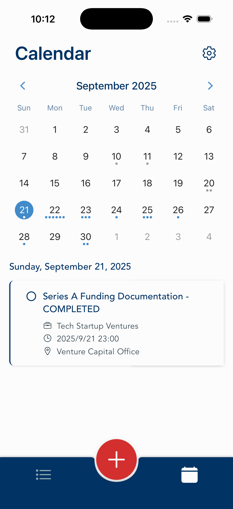
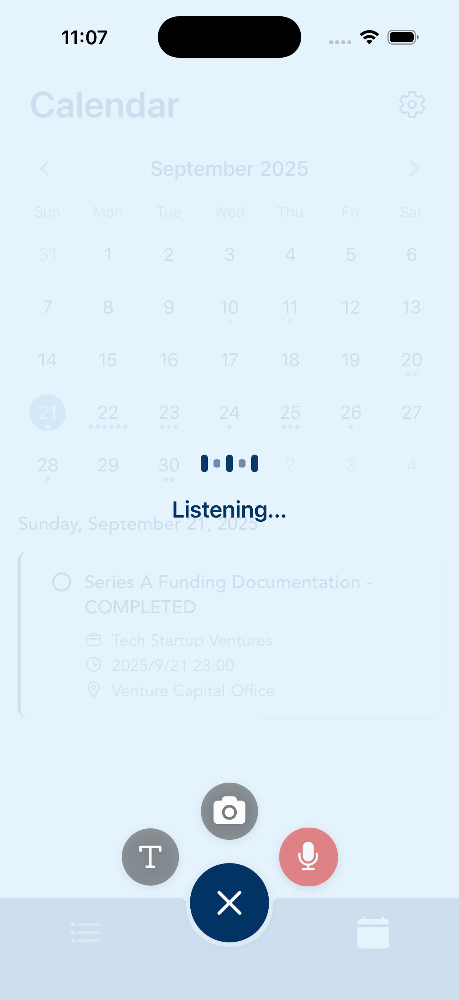
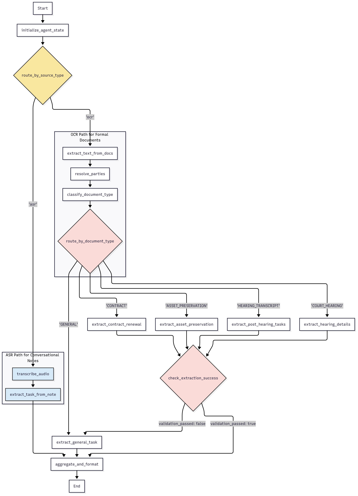
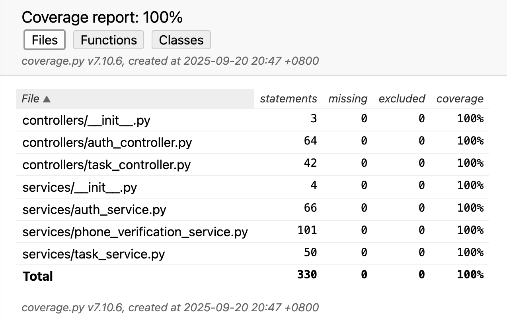
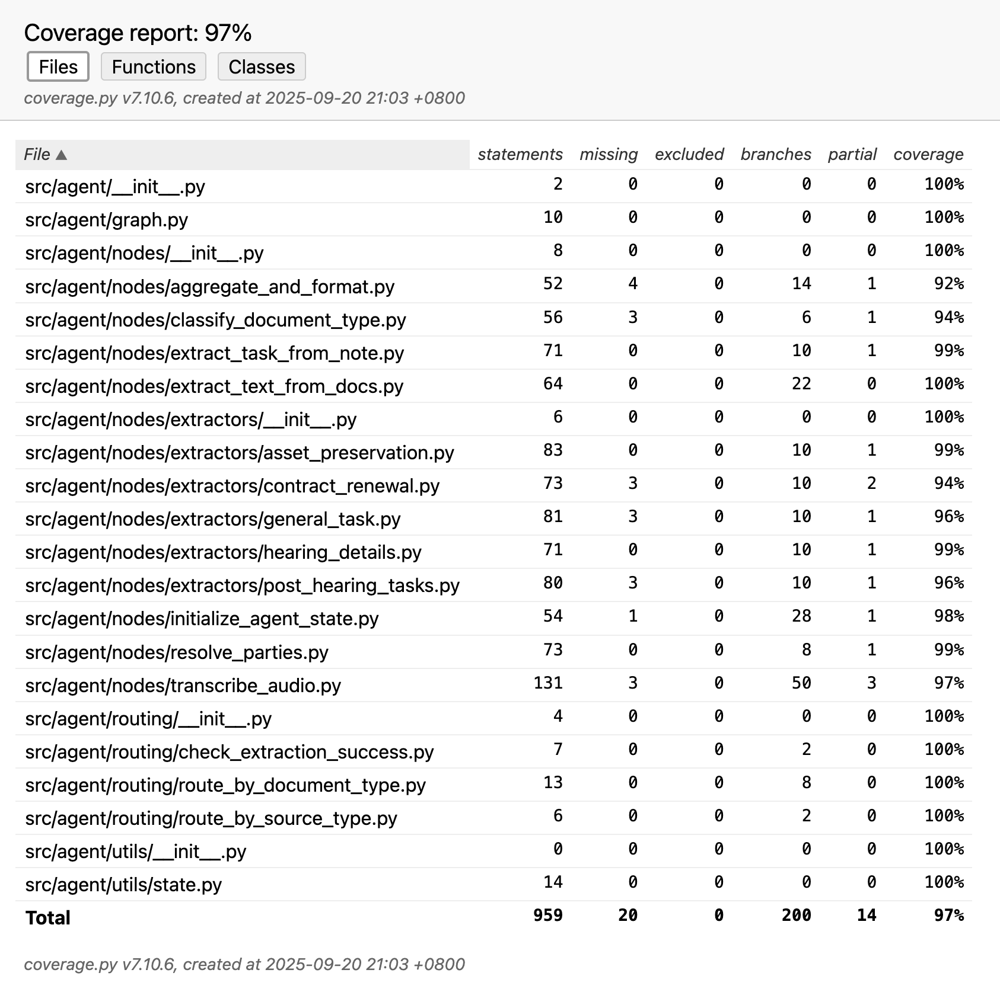

# LawTime: AI-Powered Legal Task Management

[](https://expo.dev/)
[](https://flask.palletsprojects.com/)
[](https://github.com/langchain-ai/langgraph)
[](https://supabase.com/)
[](#testing)

_UoL undergraduate thesis project demonstrating multi-modal AI orchestration for mission-critical legal workflows using three pre-trained models (OCR, ASR, LLM)._

## 📖 Project Overview

Independent attorneys and small law firms in China face high malpractice risk from **missed court deadlines**. Existing tools either demand heavy manual entry or target large firms with expensive enterprise software.

**LawTime** fills this gap:

- Automates deadline extraction from summons images and Mandarin voice notes.
- Uses a **propose–confirm workflow**: AI drafts, lawyers approve.
- Deploys in **China-first environments** with Alibaba Cloud + Supabase.

⚡ **Impact:** shrinks a 5–10 minute manual process into ~15 seconds of AI-assisted scheduling.

<table style="width: 100%; border-collapse: collapse;">
  <tr>
    <td style="width: 33.33%; text-align: center; padding: 10px; vertical-align: top;">
      
      <br><strong>Authentication Screen</strong>
    </td>
    <td style="width: 33.33%; text-align: center; padding: 10px; vertical-align: top;">
      
      <br><strong>Calendar Screen (Home)</strong>
    </td>
    <td style="width: 33.33%; text-align: center; padding: 10px; vertical-align: top;">
      
      <br><strong>Tasks Screen</strong>
    </td>
  </tr>
  <tr>
    <td style="width: 33%; text-align: center; padding: 10px; vertical-align: top;">
      
      <br><strong>Action Menu</strong>
    </td>
    <td style="width: 33%; text-align: center; padding: 10px; vertical-align: top;">
      
      <br><strong>New Task Screen</strong>
    </td>
    <td style="width: 33%; text-align: center; padding: 10px; vertical-align: top;">
      
      <br><strong>Settings Screen</strong>
    </td>
  </tr>
</table>

## ✨ Key Features

- **🤖 Multi-Modal AI Orchestration**

  - Qwen-VL-OCR: document intelligence
  - Paraformer-v2: Mandarin ASR with legal vocabulary
  - Qwen-3: LLM for event extraction

- **✅ Human-in-the-Loop**  
  Propose–confirm design keeps lawyers in control of high-stakes tasks.

- **📱 Cross-Platform Mobile App**  
  React Native + Expo, Material Design 3, iOS & Android.

- **🧪 Robust Testing**  
  971 tests (100% backend, 97% AI workflows, 547 frontend).

- **🌐 China-Accessible Architecture**  
  Supabase with Row-Level Security (RLS), Alibaba Cloud SMS OTP + hosting.

## 🏗️ Architecture


**Stack:**

- **Frontend:** React Native + Expo
- **Backend:** Flask microservice + LangGraph
- **Database:** Supabase (PostgreSQL + storage)
- **AI Services:** Qwen-VL-OCR, Paraformer-v2, Qwen-3

### 🤖 AI Workflow



AI Workflows orchestrated with LangGraph (OCR path for documents, ASR path for voice). Graceful fallback ensures users always remain productive.

## 📂 Repo Structure

```
lawTime/
├── client/           # React Native + Expo mobile app
├── server/           # Flask backend + AI microservice
├── langgraph/        # Dev-only LangGraph playground (prompt + workflow testing)
└── supabase/         # Supabase configuration files
```

## 🚀 Installation

### Prerequisites

- Node.js v18+, Python 3.9+, Expo CLI, Git

### Setup

```bash
# Clone and setup environment
git clone https://github.com/lothronx/cm3070-lawtime.git
cd lawTime

# Copy environment files and configure
cp client/.env.example client/.env.local
cp server/.env.example server/.env.local

# Create and activate Python virtual environment, install backend dependencies
python -m venv .venv && source .venv/bin/activate && pip install -r server/requirements.txt

# Install frontend dependencies
cd client && npm install

```

### Running

```bash
# Mobile app
cd client && npm start

# Backend
cd server && python run_server.py
```

## 🧪 Testing

```bash
# Frontend
cd client && npm test

# Backend
cd server && make test

# AI Workflows
cd langgraph && make test
```

<div style="display: flex; justify-content: space-around; align-items: center; flex-wrap: wrap; gap: 20px; margin: 20px 0;">
  <div style="text-align: center;">
    
    <br><strong>Backend API Tests (100% Coverage)</strong>
  </div>
  <div style="text-align: center;">
    
    <br><strong>AI Workflow Tests (97% Coverage)</strong>
  </div>
  <div style="text-align: center;">
    
    <br><strong>Frontend Tests (30 Test Suites)</strong>
  </div>
</div>

### Test Metrics

| Component        | Tests   | Coverage      | Focus                              |
| ---------------- | ------- | ------------- | ---------------------------------- |
| **Backend API**  | 133     | 100%          | Authentication, error handling     |
| **AI Workflows** | 291     | 97%           | OCR/ASR, routing, state management |
| **Frontend**     | 547     | Comprehensive | Hooks, stores, services, utilities |
| **Total**        | **971** | **High**      | **End-to-end validation**          |

🔑 **Highlights**

- Error-first testing (30% simulate failure)
- External service mocking (AI/SMS APIs)
- Fast cycle: 81s for full test suite

## 📊 Evaluation Results

- **End-to-End Workflow:** 90% success (doc/audio → valid calendar task)
- **Processing Time:** ~15s average per task
- **User Studies:** satisfaction improved 3.2 → 4.3/5 across three prototype rounds
- **Adoption Intent:** 70% of testers would adopt if reminders are added

## 🔮 Future Work

- Push notifications (schema implemented, delivery pending)
- Recurring events + calendar sync
- Offline support
- Expanded document types (asset orders, transcripts)
- WeChat integration for China adoption
