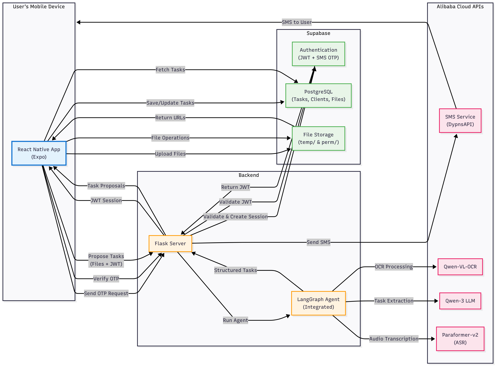
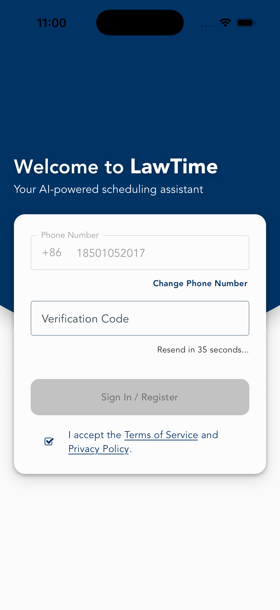
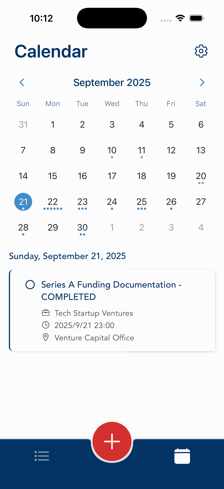
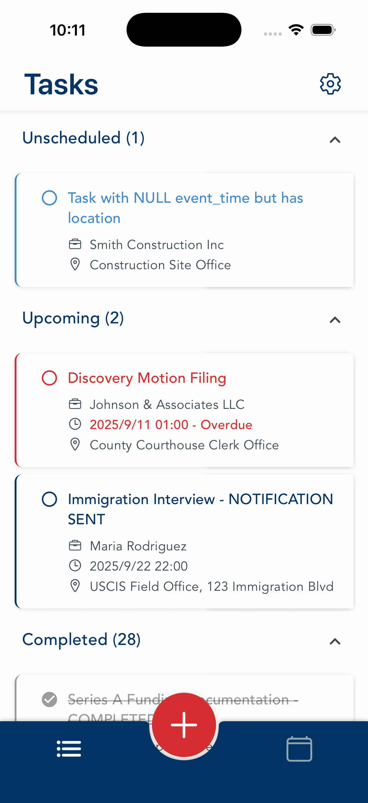
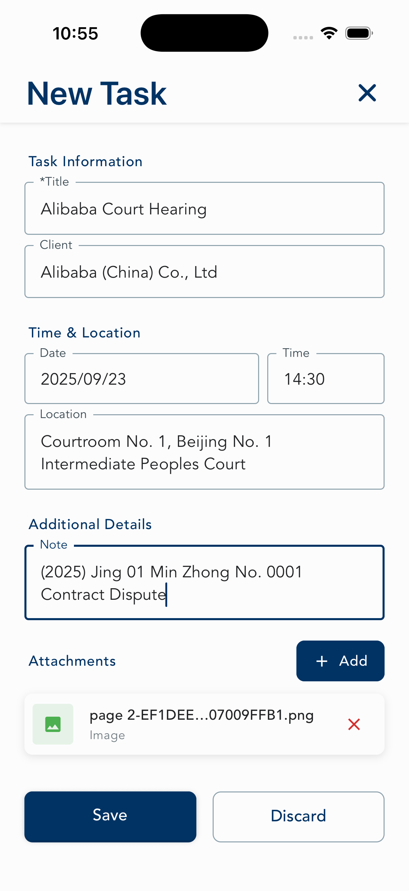
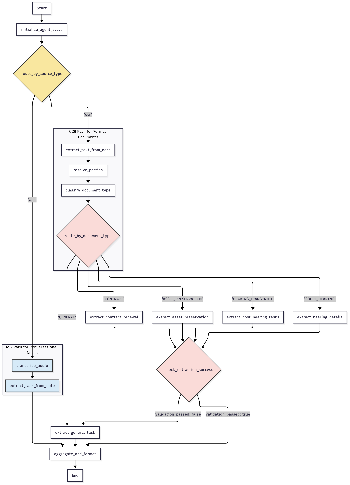
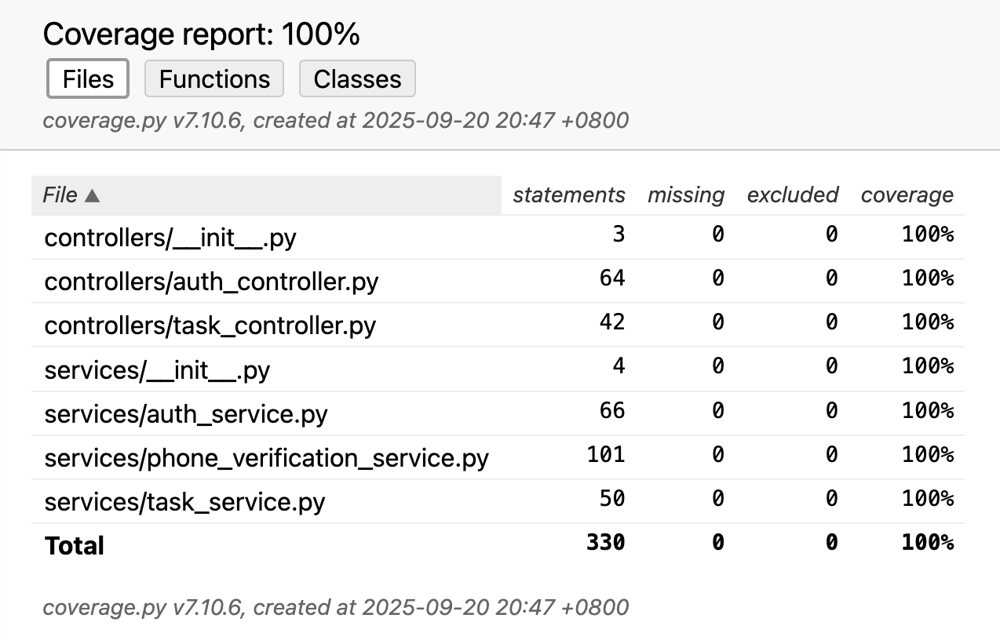
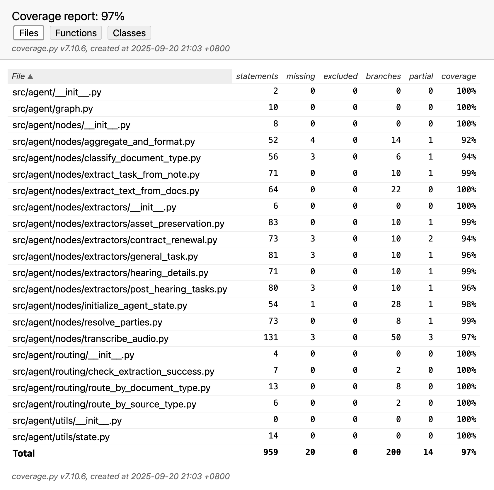
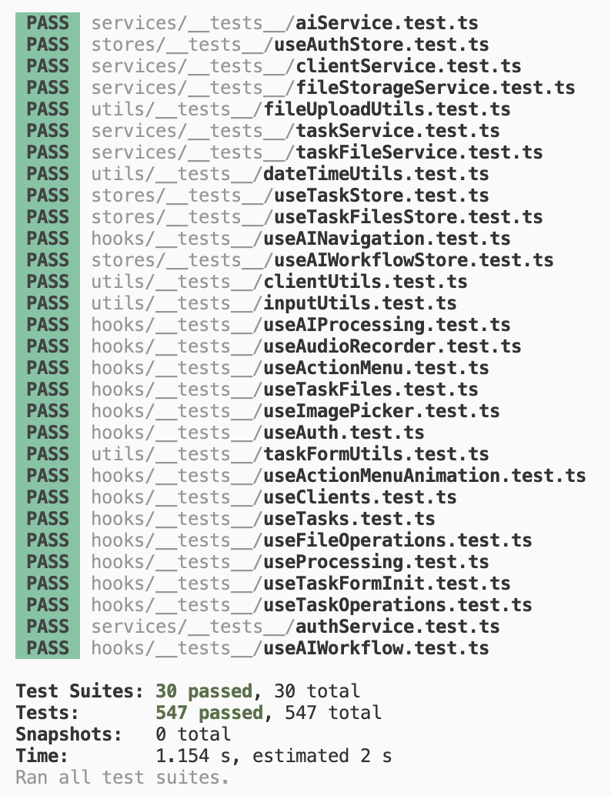

## Application Overview

**LawTime** transforms how legal professionals manage critical deadlines by automatically extracting tasks from documents and voice notes using advanced AI workflows. Instead of manually transcribing court notices and meeting notes—a process prone to costly human error—lawyers simply photograph documents or record voice memos, and the system intelligently proposes structured calendar entries for validation.

This project tackles the fascinating challenge of building reliable AI systems for high-stakes professional environments. The implementation orchestrates OCR, speech recognition, and large language models through a sophisticated LangGraph workflow, while navigating real-world deployment constraints including regulatory compliance and network accessibility requirements.

With 971 comprehensive tests spanning React Native frontend, Flask backend, and LangGraph AI workflows, the full-stack architecture features graceful AI degradation that ensures continuous productivity whether AI processing succeeds or fails—demonstrating practical approaches to AI reliability in mission-critical applications.

## Table of Contents

- [Key Features](#key-features)
- [User Flow](#user-flow)
- [Technology Selection & Architectural Constraints](#technology-selection--architectural-constraints)
- [System Architecture Diagram](#system-architecture-diagram)
- [API Specification](#api-specification)
- [Frontend Structure](#frontend-structure)
- [Backend Structure](#backend-structure)
- [Database and Storage Schema](#database-and-storage-schema)
- [Agentic Workflow](#agentic-workflow)
- [Tests](#tests)
- [Error Handling](#error-handling)
- [Security](#security)
- [Scope](#scope)

## Key Features

The implementation addresses core challenges in AI orchestration, mobile development, and China market deployment constraints.

### 1. Multi-Modal AI Task Extraction

- **Document Intelligence (OCR):** Legal document processing using Qwen-VL-OCR with specialized extractors for court hearings, asset preservation orders, and contract renewals. Features document classification with fallback routing for misclassified inputs.
- **Voice Intelligence (ASR):** Speech-to-task conversion using Paraformer-v2 with custom legal vocabulary, handling temporal references ("next Tuesday", "in two weeks").
- **Hybrid Architecture:** LangGraph workflow with conditional routing and graceful degradation to manual entry when AI processing fails.

### 2. Propose-Confirm Workflow Design

- **AI Accuracy Assurance:** User validation workflow where AI-generated tasks are presented as editable drafts, ensuring human oversight of critical legal deadlines.
- **Multi-Task Processing:** Batch handling of documents with sequential user confirmation and task editing.
- **State Management:** Workflow state preservation across screen transitions using Zustand stores and React Query caching.

### 3. Cross-Platform Mobile Architecture

- **React Native Implementation:** Feature-complete iOS and Android application using Expo Router and Material Design 3 theming.
- **Layered Frontend Design:** Three-tier architecture with dependency injection for improved testability and maintainability.
- **Real-Time User Feedback:** Processing overlays, validation feedback, and error handling ensuring responsive user experience.

### 4. Comprehensive Testing Strategy

- **971 Total Tests:** 100% backend coverage, 97% AI workflow coverage, and comprehensive frontend testing across service, hook, and component layers.
- **AI Workflow Validation:** Specialized testing approaches for non-deterministic AI responses with mocked external services.
- **Error-First Testing:** 30% of tests focus on error scenarios reflecting the critical nature of legal deadline management.

### 5. Deployment Environment Constraints

- **Regulatory Compliance:** SMS authentication requiring business entity registration and third-party service integration to meet regional telecommunications regulations.
- **Network Accessibility:** Alibaba Cloud-hosted Supabase deployment addressing connectivity constraints while maintaining PostgreSQL functionality and Row Level Security.
- **Localized AI Services:** Regional AI ecosystem integration ensuring reliable service access and domain-specific language understanding for legal contexts.

## User Flow

This section describes the core user interactions from a user perspective, focusing on the workflows that enable legal professionals to efficiently manage their schedules through AI-powered task extraction and manual entry.

### Authentication

Users authenticate using phone-based SMS verification:

1. **Phone Entry**: User enters mobile number and taps "Next"
2. **Verification**: User receives SMS code and enters it to complete authentication
3. **Access**: System automatically handles new user registration or existing user login

### Navigation and Interface

Authenticated users access the application through a two-tab interface:

- **Calendar View**: Monthly calendar with task indicators and daily task lists
- **Task List View**: Organized sections (Unscheduled, Upcoming, Completed) with task management
- **Action Menu**: Floating button providing three task creation methods (Manual, Document, Voice)

### Task Creation Workflows

The application supports three task creation approaches:

#### Manual Task Entry

1. User taps action menu and selects manual entry
2. User fills task form (title, client, date/time, location, notes)
3. User saves task directly to database

#### Document Processing (OCR)

1. User taps action menu and selects camera option
2. User chooses photo library or takes new photos of legal document
3. System processes pictures and extracts potential tasks
4. User reviews proposed tasks in sequence, editing or accepting each
5. User saves confirmed tasks to database

#### Voice Processing (ASR)

1. User press-and-holds microphone button on action menu
2. User speaks task description (e.g., "Court hearing next Friday at 2 PM")
3. System transcribes audio and extracts task information
4. User reviews and confirms proposed task
5. User saves proposed task to database

### Task Management

Users manage existing tasks through standard operations:

- **View Tasks**: Navigate between calendar and task list views
- **Complete Tasks**: Toggle completion status via checkbox
- **Edit Tasks**: Swipe left on task to modify its details, add/delete attachments, or delete the task
- **Task Organization**: System automatically categorizes tasks based on scheduling and completion status

### Error Recovery

When AI processing fails or produces no results, users automatically fall back to manual task entry, ensuring continuous productivity regardless of system performance.

## Technology Selection & Architectural Constraints

### China-Specific Technical Constraints

The application targets users in mainland China, creating significant technology selection constraints. International services face three primary challenges: **service blocking** (SMS/email OTP services), **geo-blocking** (OpenAI, Google AI platforms), and **performance degradation** (standard Supabase hosting). This required selecting a China-centric technology stack prioritizing local service availability and regulatory compliance.

### Frontend

**Selection**: React Native with Expo

**Rationale**: Cross-platform development was essential for efficient iOS and Android coverage. React Native delivers native performance with shared codebase benefits, while Expo's managed workflow accelerates development cycles critical for MVP validation. The mature ecosystem reduces implementation risks.

### Database & Storage

**Selection**: Alibaba Cloud-hosted Supabase

**Rationale**: Standard Supabase hosting suffers connectivity issues in China, making it unsuitable for production. Alibaba's hosted Supabase solution provides PostgreSQL functionality and storage while ensuring reliable access within China's network infrastructure. This maintains Supabase's developer experience (auto-generated APIs, Row Level Security) while solving accessibility constraints.

### Authentication

**Selection**: Hybrid Supabase + Alibaba SMS service

**Challenge**: Authentication presented the most complex constraint area. Supabase's built-in OTP services are blocked or unreliable in China. Email authentication faces additional hurdles: Chinese users prefer phone verification due to real-name registration requirements, and email delivery to major Chinese providers requires qualification reviews exceeding project scope.

**Implementation**: The system integrates Supabase's JWT framework with Alibaba's SMS service through a custom backend. This required establishing a business entity for SMS permissions, illustrating the regulatory complexity of China market entry.

### AI Services

**Agent Orchestration**: LangGraph

**Rationale**: LangGraph provides standardized workflow interfaces for complex multi-step AI operations. The framework's tools and LangSmith integration enable workflow visualization and debugging capabilities essential for agent development.

**Model Selection**: Alibaba Qwen-3, Qwen-VL-OCR, Paraformer-v2

**Primary Consideration**: The LLM represents the most critical selection for task extraction success, as OCR and ASR models have reached mature performance levels with consistent accuracy across vendors.

**LLM Analysis**: Three categories of models were evaluated:

1. **Commercial Models**: High costs with no self-deployment options. Most US-based AI services block Chinese access, making them inaccessible to target users.

2. **Legal-Specific Models**: Open-source but suffer from limited maintenance and outdated base models. Testing showed older legal-specific models does not outperform newer general-purpose alternatives while adding unnecessary MVP building complexity.

3. **General-Purpose Open Source**: Qwen-3 emerged as optimal, representing the leading open-source LLM at project start. Advantages include open-source licensing for cost-effective deployment, API availability for rapid MVP development, China accessibility, and superior Chinese legal context understanding.

**Supporting Models**: OCR and ASR evaluation prioritized performance consistency and ecosystem integration. While most OCR solutions performed adequately, ASR models showed significant differences. Custom vocabulary support substantially improved performance, crucial for this application where client company names and personal names often fall outside standard vocabularies.

**Final Selection**: Qwen-VL-OCR and Paraformer-v2 (with custom vocabulary) were chosen for ecosystem coherence with Qwen-3. This unified Alibaba approach enables centralized cost monitoring, simplified billing, and consistent service integration while maintaining open-source licensing and China accessibility.

### Backend

**Selection**: Flask-based microservice

**Rationale**: The backend serves as an integration layer unifying Supabase authentication and LangGraph capabilities for frontend access. Flask provides minimal, efficient API development needed to bridge authentication validation with agent orchestration.

### Future Deployment Considerations

**Target Platform**: Alibaba Cloud Function Compute

**Rationale**: Centralizing services within the Alibaba ecosystem provides unified cost monitoring, simplified billing, and reduced vendor complexity. This enables comprehensive cost tracking essential for project viability while maintaining integration simplicity.

The technology decisions reflect the reality of developing for the Chinese market: technical solutions must navigate regulatory constraints, service availability, and user expectations. Each selection prioritized market accessibility over theoretical ideals, demonstrating practical compromises required for China deployment.

## System Architecture Diagram



## API Specification

The LawTime backend provides three REST APIs for authentication and AI-powered task processing. All APIs use JSON for request/response bodies and include proper error handling with descriptive messages.

| API                           | Description                                                                                               | Request JSON                                                                                                                                                                                                                                                                                                                                                                     | Response JSON                                                                                                                                                                                                                                                                                                                                                                                                                                                                                                                                                                                                                                                                                                                                                                                                                                                                                                                                   |
| ----------------------------- | --------------------------------------------------------------------------------------------------------- | -------------------------------------------------------------------------------------------------------------------------------------------------------------------------------------------------------------------------------------------------------------------------------------------------------------------------------------------------------------------------------- | ----------------------------------------------------------------------------------------------------------------------------------------------------------------------------------------------------------------------------------------------------------------------------------------------------------------------------------------------------------------------------------------------------------------------------------------------------------------------------------------------------------------------------------------------------------------------------------------------------------------------------------------------------------------------------------------------------------------------------------------------------------------------------------------------------------------------------------------------------------------------------------------------------------------------------------------------- |
| **POST /api/auth/send-otp**   | Send SMS verification code to mobile number                                                               | `{"phone_number": "+8612345678900"}`                                                                                                                                                                                                                                                                                                                                             | **Success (200):** `{"status": "success", "message": "Verification code sent successfully", "expires_in_minutes": 5}`<br>**Error (400/429/500):** `{"status": "error", "message": "Error description"}`                                                                                                                                                                                                                                                                                                                                                                                                                                                                                                                                                                                                                                                                                                                                         |
| **POST /api/auth/verify-otp** | Verify SMS code and return JWT session                                                                    | `{"phone_number": "+8612345678900", "otp_code": "123456"}`                                                                                                                                                                                                                                                                                                                       | **Success (200):**<br>`{`<br>&nbsp;&nbsp;`"status": "success",`<br>&nbsp;&nbsp;`"message": "Authentication successful",`<br>&nbsp;&nbsp;`"session": {`<br>&nbsp;&nbsp;&nbsp;&nbsp;`"access_token": "jwt_token_here",`<br>&nbsp;&nbsp;&nbsp;&nbsp;`"refresh_token": "refresh_token_here",`<br>&nbsp;&nbsp;&nbsp;&nbsp;`"expires_at": "2025-09-21T12:06:36",`<br>&nbsp;&nbsp;&nbsp;&nbsp;`"token_type": "bearer",`<br>&nbsp;&nbsp;&nbsp;&nbsp;`"user": {`<br>&nbsp;&nbsp;&nbsp;&nbsp;&nbsp;&nbsp;`"id": "uuid",`<br>&nbsp;&nbsp;&nbsp;&nbsp;&nbsp;&nbsp;`"email": "+8612345678900@lawtime.temp",`<br>&nbsp;&nbsp;&nbsp;&nbsp;&nbsp;&nbsp;`"phone": "",`<br>&nbsp;&nbsp;&nbsp;&nbsp;&nbsp;&nbsp;`"created_at": "2025-01-01T12:00:00"`<br>&nbsp;&nbsp;&nbsp;&nbsp;`},`<br>&nbsp;&nbsp;&nbsp;&nbsp;`"is_new_user": false`<br>&nbsp;&nbsp;`}`<br>`}`<br>**Error (400/500):** `{"status": "error", "message": "Invalid or expired verification code"}` |
| **POST /api/tasks/propose**   | Process files with AI and return proposed tasks<br>_Requires: `Authorization: Bearer {jwt_token}` header_ | `{`<br>&nbsp;&nbsp;`"source_type": "ocr" \| "asr",`<br>&nbsp;&nbsp;`"source_file_urls": [`<br>&nbsp;&nbsp;&nbsp;&nbsp;`"http://{supabase_url}/storage/v1/object/public/file_storage/temp/{user_id}/{batch_id}/{file_name}"`<br>&nbsp;&nbsp;`],`<br>&nbsp;&nbsp;`"client_list": [`<br>&nbsp;&nbsp;&nbsp;&nbsp;`{"id": 102, "client_name": "ACME Corp"}`<br>&nbsp;&nbsp;`]`<br>`}` | **Success (200):**<br>`{`<br>&nbsp;&nbsp;`"success": true,`<br>&nbsp;&nbsp;`"proposed_tasks": [`<br>&nbsp;&nbsp;&nbsp;&nbsp;`{`<br>&nbsp;&nbsp;&nbsp;&nbsp;&nbsp;&nbsp;`"title": "Court Hearing",`<br>&nbsp;&nbsp;&nbsp;&nbsp;&nbsp;&nbsp;`"event_time": "2025-09-15T09:00:00Z",`<br>&nbsp;&nbsp;&nbsp;&nbsp;&nbsp;&nbsp;`"location": "Room 5",`<br>&nbsp;&nbsp;&nbsp;&nbsp;&nbsp;&nbsp;`"note": "Additional details or context",`<br>&nbsp;&nbsp;&nbsp;&nbsp;&nbsp;&nbsp;`"client_resolution": {`<br>&nbsp;&nbsp;&nbsp;&nbsp;&nbsp;&nbsp;&nbsp;&nbsp;`"status": "MATCH_FOUND",`<br>&nbsp;&nbsp;&nbsp;&nbsp;&nbsp;&nbsp;&nbsp;&nbsp;`"client_id": 102,`<br>&nbsp;&nbsp;&nbsp;&nbsp;&nbsp;&nbsp;&nbsp;&nbsp;`"client_name": "ACME Corp"`<br>&nbsp;&nbsp;&nbsp;&nbsp;&nbsp;&nbsp;`}`<br>&nbsp;&nbsp;&nbsp;&nbsp;`}`<br>&nbsp;&nbsp;`],`<br>&nbsp;&nbsp;`"count": 1`<br>`}`<br>**Error (400/401/500):** `{"error": "Error description"}`           |

## Frontend Structure

### 1. Application Screenshots

<table style="width: 100%; border-collapse: collapse;">
  <tr>
    <td style="width: 33.33%; text-align: center; padding: 10px; vertical-align: top;">
      
      <br><strong>Authentication Screen</strong>
      <br><small>SMS-based authentication with phone number input and verification code entry.</small>
    </td>
    <td style="width: 33.33%; text-align: center; padding: 10px; vertical-align: top;">
      
      <br><strong>Calendar Screen (Home)</strong>
      <br><small>Monthly calendar view with task indicators and selected day details. Features bottom navigation with floating action button.</small>
    </td>
    <td style="width: 33.33%; text-align: center; padding: 10px; vertical-align: top;">
      
      <br><strong>Tasks Screen</strong>
      <br><small>Organized task management with collapsible sections (Unscheduled, Upcoming, Completed) and task status toggles.</small>
    </td>
  </tr>
  <tr>
    <td style="width: 33.33%; text-align: center; padding: 10px; vertical-align: top;">
      
      <br><strong>Action Menu</strong>
      <br><small>Expandable floating action button revealing voice (microphone), document (camera), and manual (plus) input options.</small>
    </td>
    <td style="width: 33.33%; text-align: center; padding: 10px; vertical-align: top;">
      
      <br><strong>New Task Screen</strong>
      <br><small>Comprehensive task creation form with client autocomplete, date/time pickers, and attachment management.</small>
    </td>
    <td style="width: 33.33%; text-align: center; padding: 10px; vertical-align: top;">
      
      <br><strong>Settings Screen</strong>
      <br><small>User preferences for notifications and account management with logout functionality.</small>
    </td>
  </tr>
</table>

### 2. Frontend Code Structure

React Native application using Expo Router with feature-based organization:

- **`app/`** - File-based routing screens (auth, calendar, tasks, task, settings)
- **`components/`** - Reusable UI components organized by feature
- **`hooks/`** - Custom React hooks for business logic (auth, data, operations, media, AI)
- **`stores/`** - Zustand global state management (auth, tasks, files, AI workflow)
- **`services/`** - API integrations (Supabase, authentication, AI backend)
- **`theme/`** - Material Design 3 theming system
- **`types/`** - TypeScript definitions
- **`utils/`** - Shared utilities and configuration
- **`.env.local`** - Environment variables (API keys, excluded from version control)

### 3. Frontend Architecture & Design Rationale

The frontend architecture manages complex state flows in a mobile application handling both traditional user interactions and AI-driven workflows. The solution uses a layered architecture with dependency management to improve maintainability and testability.

#### Architectural Foundation

The application uses three-tier separation: presentation, business logic, and data access. This design addresses the complexity of coordinating multiple data sources (user input, AI responses, file uploads, persistent storage) while maintaining responsive UI performance. Rather than mixing business logic within components, the architecture isolates each concern into distinct layers.

The `app/` screens orchestrate multiple hooks and manage component composition. The **presentation layer** (`components/`) provides reusable UI elements. The **business logic layer** (`hooks/` and `stores/`) handles domain operations and state management. The **data access layer** (`services/`) abstracts external dependencies including Supabase APIs and AI backend communication.

#### Dependency Injection Implementation

The frontend implements dependency injection to decouple business logic from specific implementations. Traditional React Native applications often create tight coupling between components and external services, complicating testing and maintenance. This system addresses that limitation through explicit dependency provision:

```typescript
// stores/useTaskStore.ts:17-23
interface TaskDependencies {
  taskAPI: {
    createTask: (data: TaskWithClient) => Promise<{ id: number }>;
    updateTask: (id: number, data: Partial<TaskWithClient>) => Promise<TaskWithClient>;
    deleteTask: (id: number) => Promise<void>;
  };
}
```

This pattern allows business logic (`useTaskStore`) to operate independently of specific API implementations, enabling unit testing and simplified maintenance. Dependency injection occurs at the operations layer (`useTaskOperations.ts:83-91`), where concrete implementations are provided to abstract interfaces.

#### State Management Strategy

The state management combines three approaches for different requirements: **React Query** manages server state with automatic caching and synchronization. **Zustand stores** handle complex workflow state spanning multiple components. **Local React state** manages simple component-specific data.

This hybrid approach addresses the AI workflow complexity, where proposed tasks must maintain state across screen transitions while preserving form inputs and file attachments. A single state management solution proved insufficient for these diverse requirements.

#### Data Flow Implementation

The data flow follows a unidirectional pattern maintaining clear layer separation. In the task creation workflow:

User interaction in `app/task.tsx` triggers operations through `useTaskOperations`, which coordinates between the workflow store (`useTaskStore`) and data management hook (`useTasks`). The data hook performs client resolution business logic before delegating to the service layer (`taskService`) for persistence. Cache invalidation flows back through React Query, updating dependent components.

This flow centralizes business rules (client name resolution) while isolating UI concerns (navigation, loading states) in appropriate layers. The pattern scales effectively as new features require similar coordination between multiple data sources.

#### Error Handling Strategy

The error handling implements graceful degradation at each layer. Service-level errors provide technical context for debugging (`taskService.ts:29-31`), while business logic transforms these into user-appropriate messages (`useTaskStore.ts:188-194`). The UI layer receives only actionable feedback, maintaining user experience during system failures.

This approach prevents error propagation from disrupting the application while preserving diagnostic information for development and maintenance. Error boundaries operate independently at each layer, allowing partial functionality when specific subsystems encounter issues.

## Backend Structure

The backend has two main parts: database configuration files and a Flask web service.

### 1. Database Configuration (`supabase/`)

I used SQL migration files instead of the Supabase CLI because of the third-party hosted Supabase constraints. The SQL commands are executed manually in Supabase Studio.

- **`0000_initial_schema.sql`**: Defines the complete database schema including tables (`profiles`, `clients`, `tasks`, `task_files`, `user_devices`), ENUM types (`task_type`, `task_status`, `file_role`), and performance indexes.
- **`0001_rls_policies.sql`**: Implements Row Level Security (RLS) policies ensuring users can only access their own data. Each table has policies for SELECT, INSERT, UPDATE, and DELETE operations scoped to `auth.uid()`.
- **`0002_create_profile_trigger.sql`**: Creates a PostgreSQL trigger function that automatically creates a profile record when a new user registers in `auth.users`, eliminating the need for application-level profile creation logic.
- **`0003_storage_buckets_and_policies.sql`**: Creates a `file_storage` bucket with folder-based security. The `temp/` folder allows public read access for AI APIs, while the `perm/` folder restricts access to file owners only.
- **`seed_data.sql`**: Provides seed data for development and testing, including sample users, clients, and tasks with realistic legal content.

### 2. AI Microservice (`server/`)

The microservice uses a layered architecture with Flask. Services are created once and injected into controllers, which makes testing easier.

**Application Layer (`app.py`, `run_server.py`)**:

- `app.py` sets up the Flask app, creates services, and connects them to controllers.
- `run_server.py` starts the development server.

**HTTP Layer (`controllers/`)**:

- Controllers handle HTTP requests and responses, then pass work to services.
- `auth_controller.py` handles login and OTP verification endpoints.
- `task_controller.py` handles the `/api/tasks/propose` endpoint for AI processing.

**Business Logic Layer (`services/`)**:

- Services do the actual work and connect to external services.
- `task_service.py` connects Flask to the LangGraph agent and validates JWTs.
- `auth_service.py` handles Supabase authentication.
- `phone_verification_service.py` sends and verifies SMS codes via Alibaba SMS service.

**AI Agent Layer (`agent/`)**:

- `graph.py` defines the LangGraph workflow for processing documents and voice notes.
- `nodes/` contains individual processing steps like OCR, ASR, and text extraction.
- `routing/` decides which processing path to take based on document type.
- `utils/` has shared code and the agent state definition.

### Backend Architectural Decisions

**Layered Architecture**: The backend uses a three-layer structure (controllers, services, agent) to separate HTTP handling, business logic, and AI processing. This separation improves testability and maintainability when integrating multiple external services (Supabase, Alibaba AI APIs, SMS service).

**Flask + LangGraph Integration**: LangGraph runs as a library within Flask rather than as a separate microservice. This approach reduces deployment complexity while allowing the agent to share Flask's configuration and dependency management. The `task_service.py` acts as an adapter, converting HTTP requests into LangGraph's `AgentState` format.

**Minimal Supabase Connection**: The backend uses only Supabase's anon key for JWT validation, not the service role key. This follows the principle of least privilege - the backend verifies user identity but performs no database operations. All data access occurs through the frontend with user-scoped permissions.

**State-Based Workflow**: The LangGraph agent uses a shared `AgentState` object that flows through processing nodes. This enables complex conditional routing and self-correction logic while remaining more maintainable than traditional imperative code for handling various document types.

**Two-Folder Storage Architecture**: The storage design uses one `file_storage` bucket with folder-based access control. The `temp/` folder provides public read access for AI API processing, while the `perm/` folder restricts access to authenticated file owners. This approach enables atomic file moves without bandwidth overhead.

## Database and Storage Schema

The database uses five core tables with Row Level Security (RLS) policies that restrict access to authenticated users' own data. All tables include foreign key constraints to `auth.users.id` with CASCADE deletion.

### Core Tables

| Table              | Purpose                                 | Key Fields                                                                                                                                                                                                                                                                                                                       | Constraints                                                            |
| ------------------ | --------------------------------------- | -------------------------------------------------------------------------------------------------------------------------------------------------------------------------------------------------------------------------------------------------------------------------------------------------------------------------------- | ---------------------------------------------------------------------- |
| **`profiles`**     | User settings, auto-created via trigger | `id` (UUID, PK)<br>`status` (ENUM)<br>`default_alert_offset_minutes` (INT, default 1440)                                                                                                                                                                                                                                         | Links to `auth.users.id`                                               |
| **`clients`**      | Client management                       | `id` (BIGINT, PK)<br>`user_id` (UUID, FK)<br>`client_name` (TEXT)                                                                                                                                                                                                                                                                | UNIQUE(`user_id`, `client_name`)                                       |
| **`tasks`**        | Central event storage                   | `id` (BIGINT, PK)<br>`user_id` (UUID, FK)<br>`client_id` (BIGINT, FK nullable)<br>`title` (TEXT)<br>`event_time` (TIMESTAMPTZ nullable)<br>`location` (TEXT nullable)<br>`note` (TEXT nullable)<br>`completed_at` (TIMESTAMPTZ nullable)<br>`source_type` (ENUM: manual/ocr/asr)<br>`notification_sent` (BOOLEAN, default false) | Composite index on (`notification_sent`, `completed_at`, `event_time`) |
| **`task_files`**   | File metadata                           | `id` (BIGINT, PK)<br>`task_id` (BIGINT, FK)<br>`user_id` (UUID, FK)<br>`role` (ENUM: source/attachment)<br>`file_name` (TEXT)<br>`storage_path` (TEXT)<br>`mime_type` (TEXT nullable)                                                                                                                                            | CASCADE deletion on task removal                                       |
| **`user_devices`** | Push notification tokens                | `id` (BIGINT, PK)<br>`user_id` (UUID, FK)<br>`push_token` (TEXT)                                                                                                                                                                                                                                                                 | UNIQUE(`push_token`)                                                   |

### Storage Architecture

Single `file_storage` bucket with folder-based security using RLS policies:

**Temporary files** (`temp/{user_id}/{batch_id}/`):

- Public read access for AI API processing
- Authenticated upload restricted to user's folder
- Used during task creation before task confirmation

**Permanent files** (`perm/{user_id}/{task_id}/`):

- Private access, user-scoped via RLS
- Files moved from temp/ to perm/ after task creation
- Atomic move operations using Supabase storage API

The folder structure enables efficient file operations while maintaining security boundaries - AI services access temp files via public URLs during processing, then files are moved to private permanent storage after user confirmation.

## Agentic Workflow

The AI microservice implements a stateful workflow using LangGraph to orchestrate legal document and voice note processing. The system employs a classify-validate-route pattern that handles the distinct requirements of formal documents versus conversational voice input through specialized processing paths.

### Workflow State Management

The agent maintains workflow state through a typed data structure that supports both processing paths while enabling shared functionality for initialization and output formatting. The state contains input parameters (source type, file URLs, client context), processing metadata (API keys, timestamps), intermediate data (extracted text, document classifications), and final output (structured tasks for frontend consumption).

### Workflow Diagram



### Dual-Path Processing Architecture

The workflow design reflects the fundamental differences between formal legal documents and conversational voice notes, implementing distinct processing strategies for each input type:

#### ASR Path: Streamlined Voice Processing

Voice notes typically contain brief, conversational task descriptions with temporal context (e.g., "hearing next Tuesday"). The ASR path implements a simplified three-step process:

1. **Audio Transcription** - Uses Alibaba Paraformer-v2 with custom legal vocabulary to handle domain-specific terminology
2. **Task Extraction** - Single-step analysis that handles colloquial language and relative time references
3. **Output Formatting** - Direct conversion to standardized task format

This streamlined approach accommodates the conversational nature of voice input while leveraging temporal context clues for accurate scheduling.

#### OCR Path: Multi-Stage Document Analysis

Legal documents require systematic analysis due to their formal structure and complexity. The OCR path implements a five-stage process:

1. **Text Extraction** - Alibaba Qwen-VL-OCR processes document images
2. **Party Identification** - Matches document entities against known client list
3. **Document Classification** - Routes to specialist extractors (COURT_HEARING, CONTRACT, ASSET_PRESERVATION, GENERAL)
4. **Specialist Extraction** - Domain-specific processing with validation
5. **Quality Assurance** - Self-correcting fallback for failed classifications

### Validation and Self-Correction

The OCR path implements a validation mechanism that addresses the challenge of document classification accuracy. Each specialist extractor performs validation before processing:

- **Document Pattern Matching** - Verifies the document contains expected structural elements and keywords
- **Extraction with Validation** - Processes documents that pass validation checks
- **Fallback Routing** - Routes misclassified documents to a general extractor rather than failing

This pattern prevents pipeline failures while maintaining extraction quality through specialization, addressing the inherent uncertainty in document classification.

#### Prompt Engineering

Each specialist extraction node implements structured prompt engineering that combines legal domain knowledge with systematic reasoning patterns. The approach addresses three core challenges in legal document processing: validation, accuracy, and reliability.

- **Domain-Specific Validation**

Prompts establish validation criteria using legal keywords and structural requirements to prevent processing irrelevant documents. For asset preservation documents, this includes specific document types (保全告知书 (Preservation Notice), 执行裁定书 (Enforcement Ruling)) and required elements (case numbers, asset details, party information).

- **Embedded Legal Knowledge**

Rather than relying on training data, authoritative legal standards are encoded directly in prompts. This includes preservation periods (银行存款冻结: 1 年, 不动产查封: 3 年 (Bank deposits frozen: 1 year, Real property seized: 3 years)), calculation formulas, and procedural requirements that ensure compliance with current Chinese legal standards.

- **Systematic Reasoning**

Prompts guide LLMs through structured analysis workflows that mirror legal professional practices: input validation → document verification → client matching → information extraction → quality assessment. This prevents premature conclusions and ensures comprehensive processing.

- **Type-Safe Output**

Pydantic models enforce strict output schemas with enumerated types and validation rules, eliminating format inconsistencies and enabling reliable workflow integration.

- **Error Handling and Diagnostics**

Prompts include explicit error response templates with diagnostic metadata. The `ProcessingNotes` component captures validation keywords, extraction completeness assessments, and failure diagnostics, enabling real-time performance monitoring and systematic prompt improvement.

This engineering approach prioritizes systematic validation, domain expertise integration, and diagnostic feedback to ensure reliable extraction performance across diverse legal document types.

## Tests

### Testing Strategy and Coverage

The system implements comprehensive automated testing across three architectural layers, achieving **971 total tests** with 100% pass rate. Testing was prioritized due to the integration complexity between traditional web APIs and AI workflows, and the complexity of data flow and business logic.

**Backend API Testing (133 tests, 100% coverage)**:



Backend testing encompasses 133 tests across three distinct layers:

**Controller Layer Testing (44 tests)**:

- HTTP request/response validation
- Authentication flow verification
- Error handling and status code validation
- Input sanitization and parameter extraction

**Service Layer Testing (74 tests)**:

- Business logic verification
- External service integration (Supabase, Alibaba Cloud APIs)
- Data transformation and validation
- Error propagation and handling

**Integration Testing (15 tests)**:

- End-to-end HTTP workflow validation
- Multi-service interaction verification
- Real Flask application context testing

All external services are mocked to ensure test reliability, cost control, and deterministic results. The 100% coverage was achievable because the backend primarily orchestrates external services rather than implementing complex business logic.

**AI Workflow Testing (291 tests, 97% coverage)**:



AI workflow testing addresses unique challenges of stateful graph execution and non-deterministic AI responses through 276 unit tests and 15 integration tests:

**Document Processing Nodes (211 tests)**:

- OCR text extraction with Qwen-VL-OCR integration
- Multi-class document classification (5 types: court hearings, contracts, asset preservation, transcripts, general)
- Specialist extractors with domain-specific validation logic

**Audio Processing Nodes (13 tests)**:

- ASR integration with Alibaba Paraformer-v2
- Custom legal vocabulary enhancement
- Multi-format audio processing validation

**Routing Logic Nodes (18 tests)**:

- Workflow orchestration and path selection
- Validation-based re-routing mechanisms
- Error state management and fallback logic

**Integration Testing (15 tests)**:

- State preservation across node transitions
- Data integrity throughout workflow execution
- Error propagation and recovery mechanisms
- Cross-path integration (OCR vs ASR convergence)

The 97% coverage reflects comprehensive validation of workflow logic while acknowledging that some error paths are difficult to reproduce deterministically.

**Frontend Testing (547 tests)**:



Frontend testing follows a layered approach across 30 comprehensive test files:

**Service Layer Testing (6 tests)**:

- API integration with backend services
- Authentication service with Supabase
- File storage operations with secure bucket policies
- Task and client management services
- AI service communication with LangGraph backend

**Store Layer Testing (4 tests)**:

- Zustand state management validation
- AI workflow state transitions
- Authentication store behavior
- Task and file management state consistency

**Hook Layer Testing (15 tests)**:

- Custom React hooks for data fetching
- AI workflow orchestration hooks
- Authentication lifecycle management
- Media handling (image picker, audio recorder)
- Task operations and navigation

**Utility Layer Testing (5 tests)**:

- Input validation and sanitization
- Date/time manipulation for Beijing timezone
- File upload processing and validation
- Client filtering and search functionality
- Form data transformation utilities

### Testing Rationale and Approach

**External Service Mocking**: All external APIs are mocked to ensure test reliability, cost control, and deterministic results. This approach was chosen because the system primarily integrates existing services rather than implementing core algorithms.

**Error-First Testing**: Approximately 30% of tests focus on error scenarios and edge cases, reflecting the critical nature of legal deadline management where system failures could have serious professional consequences.

**Performance Optimization**: Test execution times were optimized for development workflow (total 81 seconds) to enable practical test-driven development while maintaining comprehensive coverage.

## Error Handling

The error handling strategy focuses on graceful degradation and preserving user productivity when systems fail. The most critical requirement is ensuring users can always fall back to manual task entry when AI processing fails. This approach is validated through comprehensive testing, with approximately 30% of the 971 total tests focusing on error scenarios and edge cases (detailed in the Tests section).

### Frontend Error Handling

The frontend implements a four-layer error handling flow that transforms technical errors into user-appropriate feedback while preserving application state.

**Service → Hook → Store → Component Flow**:

1. **Service Layer** (`aiService.ts`): Custom `AIServiceError` classes capture HTTP status codes and technical context from backend responses
2. **Hook Layer** (`useAIProcessing.ts`): Catches service errors, transforms them into user messages, and coordinates with stores
3. **Store Layer** (`useAIWorkflowStore.ts`): Maintains error state via `setPendingMessage()` for cross-component access
4. **Component Layer**: Displays user-friendly messages and maintains UI state during failures

**Critical Design**: The `useAIProcessing` hook treats empty AI results as success rather than failure, calling `onSuccess(0)` and routing users to manual entry instead of blocking the workflow.

### Backend Error Handling

The backend implements a three-layer error handling flow that categorizes errors systematically while preserving diagnostic information.

**Request → Controller → Service Flow**:

1. **Request Validation**: Controllers validate input and content-type before processing (`auth_controller.py:144-162`)
2. **Controller Layer**: Catches exceptions and maps them to appropriate HTTP status codes with user-friendly messages
3. **Service Layer**: Handles business logic errors and external service failures with technical context logging

**Exception Mapping Rules**:

- `ValueError` → 400 (user input validation failures)
- `RuntimeError/KeyError/TypeError` → 500 (system/external service errors)
- Authentication failures → 401 (invalid/expired JWT tokens)
- Missing required fields → 400 with specific field names in error messages

### Error Categories

- **Network Errors**: Frontend detects timeouts and connectivity issues, displays "No internet connection" while preserving user state
- **AI Processing**: Critical graceful degradation from AI extraction to manual task entry
- **Authentication**: Session expiration triggers automatic redirect to login while clearing sensitive data
- **Validation**: Field-specific error messages prevent form submission with missing required data
- **System Errors**: Technical details logged for debugging, users see generic "please try again" messages

### Example Error Flows

**AI Processing Failure Flow**:

1. User uploads document → Frontend calls `aiService.proposeTasks()`
2. Backend returns 500 error → `AIServiceError` thrown with status code
3. `useAIProcessing` catch block sets `setPendingMessage({ text: 'Task extraction failed. Please use manual input.', type: 'error' })`
4. User sees error message, workflow store maintains empty task list with source type
5. User proceeds to manual task entry without losing context

**Authentication Expiration Flow**:

1. User attempts protected action → Service layer checks JWT validity
2. Backend returns 401 Unauthorized → Frontend `useAuthStore` detects expired session
3. Auth store clears user data and tokens → Automatic redirect to authentication screen
4. User completes re-authentication → Session restored, original action can be retried

## Security

The application implements a three-layer security architecture: frontend session management, backend JWT validation, and Supabase Row Level Security (RLS). This design ensures user data isolation while enabling AI processing workflows.

### Frontend Security

Authentication uses SMS OTP with Supabase JWT tokens stored securely using `AsyncStorage` with automatic refresh handling. The `useAuthStore` (client/stores/useAuthStore.ts:1) manages session state and listens for auth changes. Token storage leverages Supabase's built-in session persistence with `autoRefreshToken: true` configured in the client (client/utils/supabase.ts:7).

The frontend never stores service keys or sensitive credentials beyond user session tokens. All API calls to the backend include JWT tokens in Authorization headers (services/authService.ts:42).

### Backend Security

The Flask backend implements JWT validation on protected endpoints. The `/api/tasks/propose` endpoint extracts and validates Bearer tokens before processing (server/controllers/task_controller.py:34). Invalid or missing tokens return 401 responses.

The backend uses Supabase's anon key for client initialization and relies on Supabase's built-in JWT verification. User identity is extracted from validated JWT claims, not request bodies, preventing user impersonation.

### Supabase Security

Row Level Security (RLS) is enabled on all user data tables with policies enforcing user-scoped access. Each table has policies ensuring users can only access records where `auth.uid()` matches the `user_id` field.

Storage security uses a single `file_storage` bucket with folder-based policies. The `temp/` folder allows public read access for AI APIs, while the `perm/` folder restricts access to file owners only. This enables AI processing without exposing permanent user files.

### Key Security Decisions

**Phone-to-Email Mapping**: Authentication converts phone numbers to email format (`{phone}@lawtime.temp`) as a walk-around because we are using a third-party SMS service.

**Stateless Backend**: The Flask server maintains no session state, relying entirely on JWT validation and Supabase RLS for security. This simplifies the architecture and reduces attack surface.

**Temporary File Security**: AI processing requires public URLs, so files are uploaded to a public `temp/` folder during processing, then moved to private `perm/` storage after user confirmation. This balances AI API requirements with data privacy.

## Scope

The following features are excluded from the scope of this MVP. For MVP development, we focus on core functionality only: authentication, data storage, and AI processing workflows.

**Push Notification System**: Originally planned with `user_devices` table and `notification_sent` fields. UI includes notification settings (client/components/settings/AlertTimePicker.tsx:1) but no delivery system was implemented. Time was redirected to authentication and storage complexities.

**Advanced Calendar Integration**: No recurring events, external calendar sync (Google, Outlook), or invitations. App uses basic calendar view with react-native-calendars.

**Offline Support**: Requires constant network connectivity. No local storage or synchronization due to complexity of file uploads and AI processing without network access.

**Multi-language Support**: App targets Chinese lawyers and needs Chinese support. AI prompts are in Chinese for proper legal terminology. UI, however, is currently English-only for this university project demonstration purposes.

**Document Viewer**: Files open using native OS rather than in-app viewer. Deprioritized to focus on core AI workflow.
